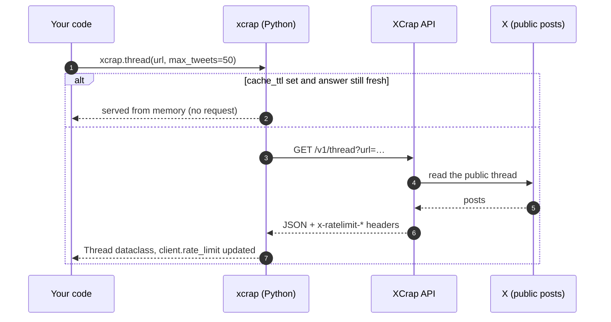
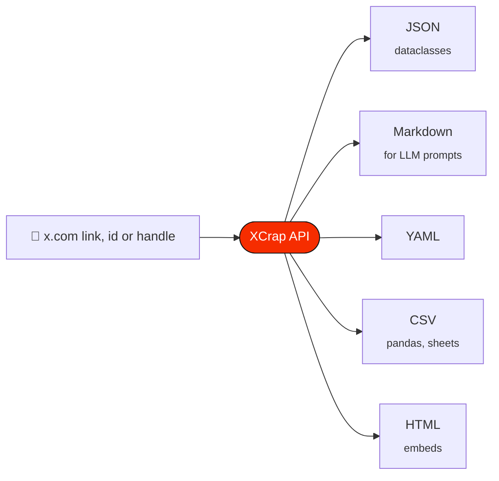
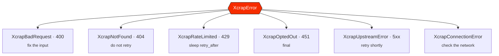

<p align="center">
  <a href="https://xcrap.cc"></a>
</p>

<p align="center">
  <a href="https://pypi.org/project/xcrap-sdk/"></a>
  <a href="https://xcrap.cc/docs"></a>
  
  
  <a href="https://github.com/XcrapCC/xcrap-python/blob/main/LICENSE"></a>
  <a href="https://github.com/XcrapCC/xcrap-python"></a>
</p>

<p align="center">
  <b>X (Twitter) posts, threads, profiles, search and media — as typed dataclasses, or Markdown you can paste straight into a model.</b><br>
  <sub>No signup · no OAuth · no bearer token · sync and async</sub>
</p>

<p align="center">
  <a href="https://xcrap.cc">Website</a> ·
  <a href="https://xcrap.cc/docs">API reference</a> ·
  <a href="https://xcrap.cc/sdk/python">SDK guide</a> ·
  <a href="https://github.com/XcrapCC/xcrap-python/tree/main/examples">Examples</a> ·
  <a href="https://github.com/XcrapCC/xcrap-node">Node SDK</a> ·
  <a href="https://github.com/XcrapCC/Xcrap-mcp">MCP server</a>
</p>

---

> [!NOTE]
> **Always in step with the API.** Every time an XCrap endpoint is added or changed, this SDK is updated and released with it, so the methods and models here always match what the API returns.

## Contents

- [Why this SDK](#why-this-sdk)
- [Install](#install)
- [How it works](#how-it-works)
- [Quick start](#quick-start)
- [Recipes](#recipes)
- [What's new in 1.3.0](#whats-new-in-130) · [1.2.0](#whats-new-in-120)
- [API](#api) — [options](#xcrapbase_url-options--asyncxcrapbase_url-options) · [methods](#methods) · [client state](#client-state) · [errors](#errors)
- [Rate limits](#rate-limits)
- [Examples](#examples)
- [Tests](#tests)
- [Related repositories](#related-repositories)

## Why this SDK

| | |
| --- | --- |
| 🔑 **No API key** | No signup, no OAuth, no bearer token. `Xcrap()` and you are reading. |
| ⚡ **Sync and async** | `Xcrap` and `AsyncXcrap`, same surface, both context managers. |
| 🧩 **Typed** | Dataclasses mirroring the API's shapes, full hints, `py.typed`. |
| 🪶 **One dependency** | `httpx`. |
| 📝 **Markdown-first** | `markdown=True` on every read method, with a token estimate in `client.last_meta.markdown_tokens`. |
| 🧠 **Optional response cache** | `Xcrap(cache_ttl=60)` keeps answers in memory, so repeats cost no request. |
| 🚦 **Rate-limit aware** | `client.rate_limit` after every call, and a typed `XcrapRateLimited` with `retry_after`. |

## Install

```bash
pip install xcrap-sdk
```

<details>
<summary>Other package managers</summary>

```bash
uv add xcrap-sdk
poetry add xcrap-sdk
pipenv install xcrap-sdk
```

</details>

> [!TIP]
> The package installs as **`xcrap-sdk`** and imports as **`xcrap`**.

```python
from xcrap import Xcrap, AsyncXcrap

xcrap = Xcrap()  # talks to https://xcrap.cc
```

Both clients are context managers, which is the tidiest way to close the connection pool:

```python
with Xcrap() as xcrap:
    ...

async with AsyncXcrap() as xcrap:
    ...
```

## How it works



Pick the shape you need with `format=` — JSON comes back as dataclasses, everything else as a `str`:



## Quick start

```python
from xcrap import Xcrap

with Xcrap() as xcrap:
    tweet = xcrap.tweet("https://x.com/jack/status/20")

    print(tweet.text)                   # just setting up my twttr
    print(tweet.author.screen_name)     # jack
    print(tweet.metrics.likes)          # 308067
```

A bare id works too: `xcrap.tweet("20")`.

## Recipes

<details open>
<summary><b>📝 Feed a post to an LLM as Markdown</b></summary>

```python
with Xcrap() as xcrap:
    markdown = xcrap.tweet("https://x.com/jack/status/20", markdown=True)
    print(markdown)
    print(f"~{xcrap.last_meta.markdown_tokens} tokens")  # budget your context window
```

Every read method takes `markdown=True`, or `format="json" | "markdown" | "yaml" | "csv" | "html"`. JSON comes back as dataclasses; every other format comes back as a `str`.

</details>

<details>
<summary><b>🧵 Unroll a thread</b></summary>

```python
with Xcrap() as xcrap:
    thread = xcrap.thread(
        "https://x.com/naval/status/1002103360646823936",
        max_tweets=50,
    )

    print(f"@{thread.author.screen_name} — {thread.count} posts")
    for index, post in enumerate(thread.tweets, start=1):
        print(f"{index}. {post.text}")

    if thread.truncated:
        print("…thread was longer than max_tweets")
```

</details>

<details>
<summary><b>📜 Page an account's timeline</b></summary>

```python
with Xcrap() as xcrap:
    # One page at a time, cursor in hand:
    page = xcrap.user_tweets("nasa", count=20, exclude_replies=True)
    while page.next_cursor:
        for post in page.tweets:
            print(post.created_at, post.text[:60])
        page = xcrap.user_tweets("nasa", count=20, cursor=page.next_cursor)

    # Or let the SDK walk the pages for you:
    for post in xcrap.iter_user_tweets("nasa", count=20, limit=100):
        print(post.id, post.text[:60])
```

</details>

<details>
<summary><b>🗂️ Export an account's history (with reposts)</b></summary>

```python
with Xcrap() as xcrap:
    history = xcrap.user_history(
        "naval",
        max_posts=500,
        since="2025-01-01",
        include_reposts=True,
    )

    print(f"{history.count} posts")
    print("stopped because:", history.stop_reason)  # max_posts | window | end_of_timeline | page_limit | upstream_error
```

</details>

<details>
<summary><b>🔎 Search with X's own operators</b></summary>

```python
with Xcrap() as xcrap:
    result = xcrap.search("from:nasa mars", feed="top", since="2025-01-01")
    for post in result.tweets:
        print(post.text)

    if result.next_cursor:
        more = xcrap.search("from:nasa mars", feed="top", cursor=result.next_cursor)
```

`feed` is `latest` (default), `top`, `photos` or `videos`.

</details>

<details>
<summary><b>🖼️ Download media</b></summary>

```python
with Xcrap() as xcrap:
    url = "https://x.com/NASA/status/1793412932641689801"

    listing = xcrap.media(url)
    print(f"{listing.count} attachment(s)")

    for item in listing.media:
        file = xcrap.download_media(url, index=item.index, quality="best")
        saved = file.save()          # uses the suggested filename
        print(f"saved {saved} ({file.content_type}, {file.content_length} bytes)")
```

</details>

<details>
<summary><b>📦 Resolve fifty posts in one call</b></summary>

```python
with Xcrap() as xcrap:
    result = xcrap.bulk([
        "https://x.com/jack/status/20",
        "https://x.com/nasa/status/1",
        "1849565662058590299",
    ])

    print(f"{result.succeeded} ok, {result.failed} failed")
    for item in result.results:
        if item.ok:
            print("✓", item.tweet.text)
        else:
            print("✗", item.input, item.error["message"])
```

Bulk takes at most 50 URLs and never fails the whole batch for one bad link.

</details>

<details>
<summary><b>⚡ Async, with concurrency</b></summary>

```python
import asyncio
from xcrap import AsyncXcrap

async def main() -> None:
    async with AsyncXcrap() as xcrap:
        handles = ["nasa", "jack", "esa"]
        users = await asyncio.gather(*(xcrap.user(h) for h in handles))
        for user in users:
            print(f"@{user.screen_name}: {user.metrics.followers:,} followers")

        async for post in xcrap.iter_user_tweets("nasa", limit=50):
            print(post.text[:60])

asyncio.run(main())
```

</details>

<details>
<summary><b>🚨 Handle errors by type</b></summary>

```python
from xcrap import (
    Xcrap,
    XcrapBadRequest,
    XcrapNotFound,
    XcrapOptedOut,
    XcrapRateLimited,
    XcrapUpstreamError,
)
import time

with Xcrap() as xcrap:
    try:
        tweet = xcrap.tweet("https://x.com/jack/status/20")
    except XcrapNotFound as error:
        print("Gone for good:", error)
    except XcrapRateLimited as error:
        print(f"Budget spent, sleeping {error.retry_after}s")
        time.sleep(error.retry_after)
    except XcrapOptedOut:
        print("Account opted out — do not retry")
    except XcrapUpstreamError:
        print("Transient, retry in a minute")
    except XcrapBadRequest as error:
        print("Fix the input:", error.hint)
```

Every message ends with the action that resolves it, so it is safe to surface directly to a user or an agent.

</details>

<details>
<summary><b>🚦 Watch your rate-limit budget</b></summary>

```python
with Xcrap() as xcrap:
    xcrap.trends(count=10)

    limit = xcrap.rate_limit
    print(f"{limit.remaining}/{limit.limit} left, window resets at {limit.reset_at:%H:%M:%S}")
```

</details>

## What's new in 1.3.0

| | |
| --- | --- |
| 🪦 **Why a post is gone** | `XcrapNotFound` carries `reason`: `post_deleted`, `author_protected`, `author_suspended`, `withheld`, `removed_by_x`, `age_restricted`, or `unavailable` when X does not say. |
| 🏷️ **`visibility`** | A post X has restricted carries X's own notice, whether X shows it less widely, and which actions X turned off. `None` on ordinary posts. |
| 📐 **`signals`** | `tweet(url, signals=True)` adds the post's age, whether it is inside For You's 48-hour window, whether the author may qualify for X's new-author slot, and engagement ratios. Facts from public data, not a ranking score. |

```python
try:
    xcrap.tweet("https://x.com/someone/status/2101177906030399610")
except XcrapNotFound as error:
    print(error.reason)  # post_deleted

post = xcrap.tweet("20", signals=True)
print(post.signals.in_for_you_window)  # False
```

## What's new in 1.2.0

| | |
| --- | --- |
| 🧠 **In-memory response cache** | `Xcrap(cache_ttl=60)` keeps successful GET responses for that many **seconds**. A repeat costs no request and no rate limit. `fresh=True` always skips it; `clear_cache()` empties it. |
| 🔁 **`include_reposts`** | `user_history(handle, include_reposts=True)` also returns the posts the account reposted. |
| 🛑 **`stop_reason`** | History responses say why the walk stopped: `max_posts`, `window`, `end_of_timeline`, `page_limit` or `upstream_error` (the posts collected until then are still returned). |

```python
with Xcrap(cache_ttl=60) as xcrap:  # one minute
    xcrap.user("nasa")  # one request
    xcrap.user("nasa")  # answered from memory
    xcrap.clear_cache()
```

## API

### `Xcrap(base_url=..., **options)` / `AsyncXcrap(base_url=..., **options)`

| option        | default              | meaning                                                   |
| ------------- | -------------------- | --------------------------------------------------------- |
| `base_url`    | `https://xcrap.cc`   | API origin. Leave it; change it only to route through a proxy you control |
| `timeout`     | `30.0`               | Per-request timeout, seconds                              |
| `retries`     | `1`                  | Retries on 502/503/504 and transport errors               |
| `retry_delay` | `0.5`                | Backoff before a retry, seconds                           |
| `cache_ttl`   | `0.0`                | Keep successful GET responses in memory this many seconds; `0` is off |
| `user_agent`  | `xcrap-python-sdk/…` | Replaces the default descriptive agent                    |
| `headers`     | `{}`                 | Extra headers on every request                            |
| `client`      | `None`               | Bring your own `httpx.Client` / `AsyncClient`             |

> [!IMPORTANT]
> A 4xx is **never** retried. Fix the input (400), give up (404, 451), or wait out the window (429).

### Methods

| method                                | endpoint             | returns                    |
| ------------------------------------- | -------------------- | -------------------------- |
| `tweet(url, ...)`                      | `/v1/tweet`          | `Tweet`                    |
| `thread(url, max_tweets=25, ...)`      | `/v1/thread`         | `Thread`                   |
| `user(handle, ...)`                    | `/v1/user`           | `User`                     |
| `user_tweets(handle, count=20, cursor=None, exclude_replies=True, media_only=False, ...)` | `/v1/user/tweets` | `Timeline` |
| `iter_user_tweets(handle, limit=None, ...)` | `/v1/user/tweets` | iterator of `Tweet`      |
| `user_history(handle, max_posts=200, since=None, until=None, include_replies=False, include_reposts=False, ...)` | `/v1/user/history` | `AccountHistory` |
| `search(query, feed="latest", since=None, until=None, cursor=None, ...)` | `/v1/search` | `SearchResult` |
| `replies(url, sort="top", ...)`        | `/v1/replies`        | `Replies`                  |
| `followers(handle, cursor=None, ...)`  | `/v1/user/followers` | `UserList`                 |
| `following(handle, cursor=None, ...)`  | `/v1/user/following` | `UserList`                 |
| `trends(count=20, ...)`                | `/v1/trends`         | `TrendsResult`             |
| `media(url, ...)`                      | `/v1/media`          | `MediaList`                |
| `download_media(url, index=0, quality="best")` | `/v1/media/download` | `DownloadedMedia` |
| `bulk(urls, ...)`                      | `/v1/bulk`           | `BulkResult` (≤ 50 urls)   |
| `clear_cache()`                        | —                    | empties the in-memory response cache |

Every read method accepts `markdown=`, `format=` and `fresh=`. `fresh=True` bypasses both the server's five-day cache and the client cache. `AsyncXcrap` has the same methods as coroutines, and `iter_user_tweets` becomes an async iterator.

### Client state

- `client.rate_limit` — `RateLimit(limit, remaining, reset, reset_at)` from the last response.
- `client.last_meta` — `ResponseMeta` (format, cache status, `markdown_tokens`) from the last response.

### Errors

| class                  | status | when                                                    |
| ---------------------- | ------ | ------------------------------------------------------- |
| `XcrapBadRequest`      | 400    | missing or unparseable parameter                         |
| `XcrapNotFound`        | 404    | deleted, suspended, private or nonexistent               |
| `XcrapRateLimited`     | 429    | budget spent — carries `retry_after`, `reset_at`, `budget` |
| `XcrapOptedOut`        | 451    | the account opted out of XCrap                           |
| `XcrapUpstreamError`   | 5xx    | X could not be reached or timed out; usually transient   |
| `XcrapConnectionError` | —      | DNS, TLS, socket or timeout failure                      |
| `XcrapError`           | —      | base class for all of the above                          |



## Rate limits

Budgets are per endpoint, per IP, and every response carries `x-ratelimit-limit` / `-remaining` / `-reset`.

| endpoint                                   | method(s)                                | budget                          |
| ------------------------------------------ | ---------------------------------------- | ------------------------------- |
| `/v1/tweet`                                | `tweet`                                  | 45 / minute                     |
| `/v1/user`                                 | `user`                                   | 45 / minute                     |
| `/v1/thread`                               | `thread`                                 | 15 / minute                     |
| `/v1/user/tweets`                          | `user_tweets`, `iter_user_tweets`        | 15 / minute                     |
| `/v1/user/followers`, `/v1/user/following` | `followers`, `following`                 | 15 / minute                     |
| `/v1/replies`                              | `replies`                                | 15 / minute                     |
| `/v1/user/history`                         | `user_history`                           | 4 / 5 minutes                   |
| `/v1/search`                               | `search`                                 | 10 / 15 minutes                 |
| `/v1/bulk`                                 | `bulk`                                   | 6 / 5 minutes (up to 50 posts each) |
| `/v1/media`, `/v1/media/download`          | `media`, `download_media`                | 20 / minute                     |
| `/v1/trends`                               | `trends`                                 | 90 / minute                     |

> [!TIP]
> Set `cache_ttl` to stop spending budget on repeats, and prefer one `bulk()` over many `tweet()` calls.

> [!IMPORTANT]
> **Need more headroom?** The [Enterprise plan](https://xcrap.cc/enterprise) offers higher rate limits, dedicated capacity, custom endpoints and formats, priority support, and invoices or agreements — with the same rules (public accounts only). Write to **[hello@xcrap.cc](mailto:hello@xcrap.cc)**.

## Examples

Small, runnable projects live in [`examples/`](https://github.com/XcrapCC/xcrap-python/tree/main/examples/). Each works as soon as you install it — there is no key to set up.

| Example | What it does | Extra dependency |
| --- | --- | --- |
| 💻 [`cli/`](https://github.com/XcrapCC/xcrap-python/tree/main/examples/cli/) | `xcrap-cli tweet`, `thread`, `user`, `search` and `history` from your terminal, saving to CSV, Markdown or JSON | none (`argparse`) |
| 🎮 [`discord-bot/`](https://github.com/XcrapCC/xcrap-python/tree/main/examples/discord-bot/) | Turns X links into clean embeds and sends `!thread` as a Markdown file | `discord.py` 2.x |
| ✈️ [`telegram-bot/`](https://github.com/XcrapCC/xcrap-python/tree/main/examples/telegram-bot/) | `/tweet`, `/thread` and automatic link expansion | `python-telegram-bot` v21 |
| 🗄️ [`thread-archiver/`](https://github.com/XcrapCC/xcrap-python/tree/main/examples/thread-archiver/) | Saves a list of threads to `archive/<handle>-<id>.md`, waiting out rate limits | none |
| 🤖 [`ai-summary/`](https://github.com/XcrapCC/xcrap-python/tree/main/examples/ai-summary/) | Builds a ready-to-send summary prompt from a thread, for any LLM | none |

```bash
cd examples/cli
python -m venv .venv && source .venv/bin/activate
pip install -r requirements.txt
python xcrap_cli.py tweet https://x.com/jack/status/20
```

Stop a running bot with <kbd>Ctrl</kbd> + <kbd>C</kbd>.

## Tests

```bash
pip install -e ".[test]"
pytest -v
```

Most of the suite is an integration smoke test: it talks to the live API, because that is the only thing that proves the client and the API still agree.

## Related repositories

| Repository | What it is |
| --- | --- |
| 🟩 [**xcrap-node**](https://github.com/XcrapCC/xcrap-node) | The Node.js SDK — `npm install @xcrapcc/sdk` |
| 🤖 [**Xcrap-mcp**](https://github.com/XcrapCC/Xcrap-mcp) | The MCP server for Claude, Cursor and other agents — `npx -y @xcrapcc/mcp` |
| 📖 [**xcrap-docs**](https://github.com/XcrapCC/xcrap-docs) | Guides, API reference, OpenAPI 3.1, `llms.txt` and `skills.md` |
| 🏠 [**XcrapCC**](https://github.com/XcrapCC) | Everything XCrap on GitHub |

---

<p align="center">
  <a href="https://xcrap.cc"><b>xcrap.cc</b></a> · <a href="https://xcrap.cc/docs">Docs</a> · <a href="https://xcrap.cc/openapi.json">OpenAPI</a> · <a href="https://xcrap.cc/llms.txt">llms.txt</a> · <a href="https://xcrap.cc/skills.md">skills.md</a><br>
  <sub>MIT licensed · Public data only · Not affiliated with X Corp.</sub>
</p>
